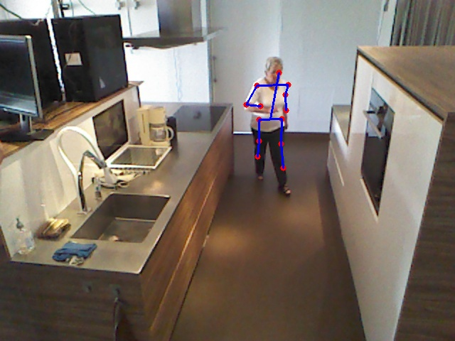

*2D pose Visualizaiton

In this repo, we provide a simple visualization code for 2D Pose on our dataset. 
- The `json_to_npz.py` can transfer the json to the npz style data. 
- `skeleton_visualization_single_image.py` is used to visualize the 2D pose on a single image. 

